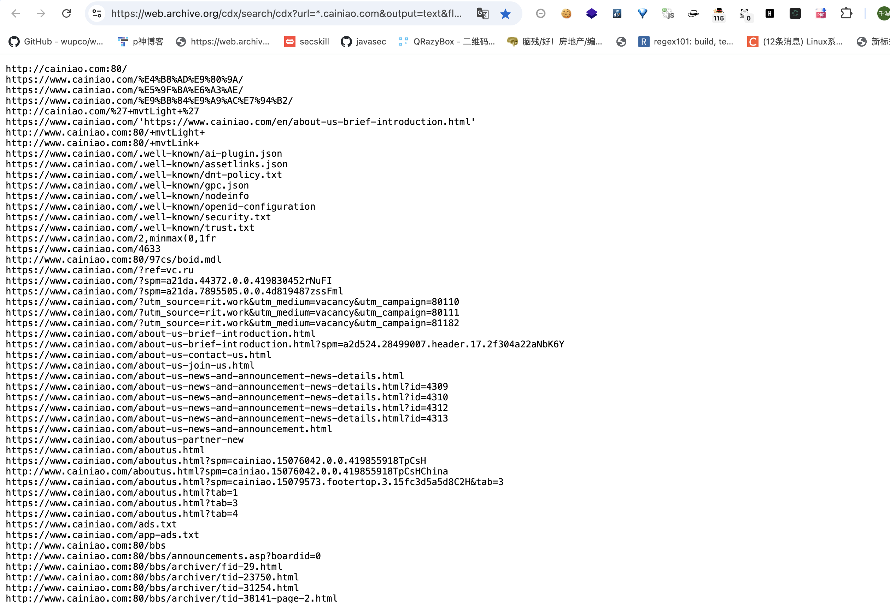
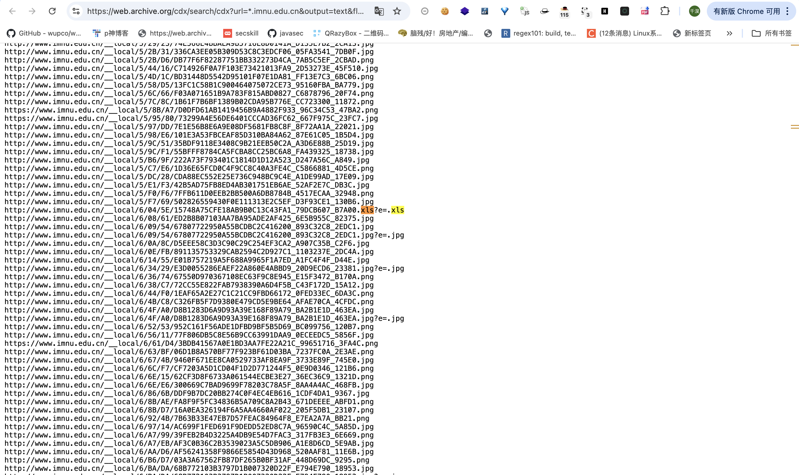
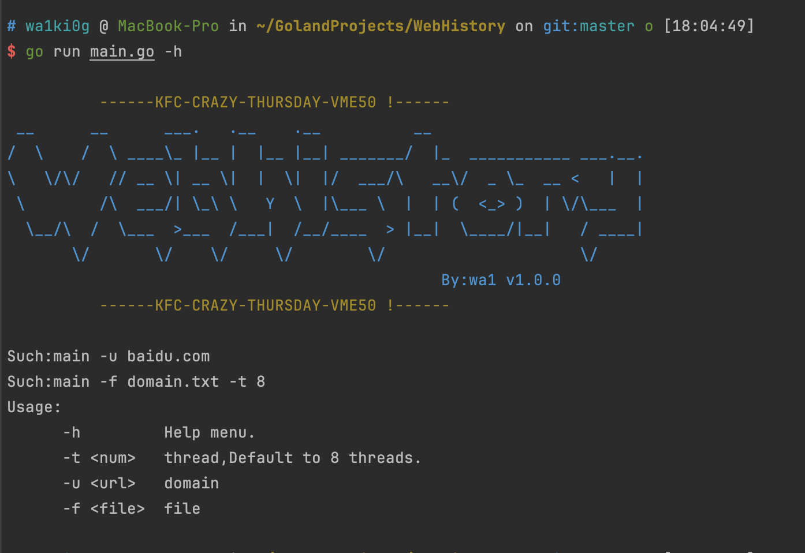
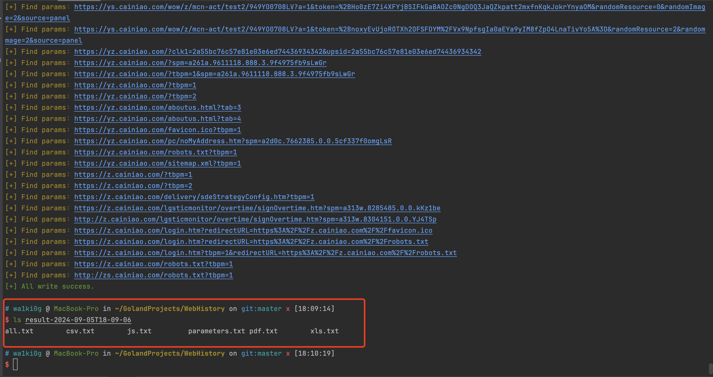
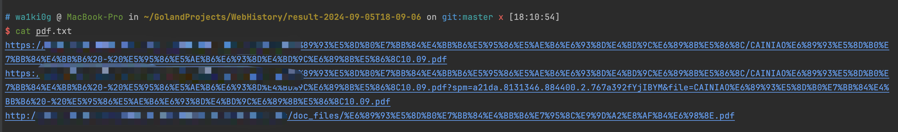

# WebHistory

## \[简介]

以前挖洞的时候写的一个基于[web.archive.org](http://web.archive.org "web.archive.org")的工具。比如输入为baidu.com，那么他会爬取baidu.com及其所有子域的历史记录，并提取pdf，xls，js，csv等结尾的与包含参数请求的url地址，可以自己写个nuclei的规则再扫下js里的key什么的。

Wayback Machine 这玩意存储了自1996年以来的网页数据，涵盖记录了大量的网站、请求和页面：





墙了的网站，使用工具的时候要设置下代理：

```java
export https_proxy=http://127.0.0.1:9901 http_proxy=http://127.0.0.1:9901 all_proxy=socks5://127.0.0.1:9901
```

## \[功能]



```bash
Such:main -u baidu.com
Such:main -f domain.txt -t 8
Usage:
      -h         Help menu.
      -t <num>   thread,Default to 8 threads.
      -u <url>   domain
      -f <file>  file


```





## \[使用方法]

main -u baidu.com

main -f domain.txt -t 8

输出在同目录下时间命名的文件夹里
